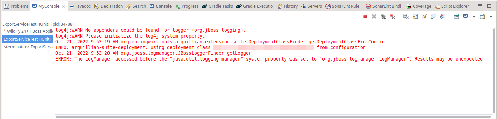

# MyConsole Eclipse Plugin
This plugin adds a new view "MyConsole" in Eclipse that overrides the existing Console View and adds a list of all the opened console on the left of it.

It allows you to see all the opened console without having to open a menu and to switch between them. You can also close a console via the context menu.

For TextConsoles, a marker `'*'` is append to the console name to show new text has been written.

## Installation

Download (or build) the jar and drop it in your Eclipse's `dropins` folder.

You can download the jar from the release page (hopefully, if I figure it out) or using [this link](https://stuff.stooit.com/d/1/635251c55df86/com.stooit.betterconsole_1.0.0.202210210944.jar)